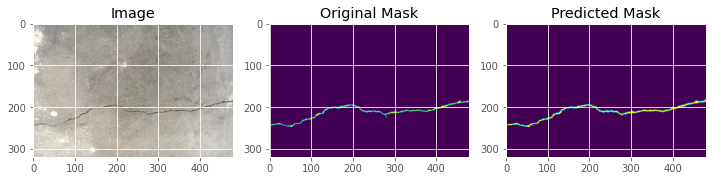

The goal of the project is to design a pipeline to segment crack pixels in damaged infrastructure within the context of federated learning using iid and non-iid data.

For this project, the following two datasets will be used.

- Dataset of cracks on concrete https://data.mendeley.com/datasets/jwsn7tfbrp/1 provided by the Middle East University of Technology.

- Dataset of cracks on asphalt https://github.com/juhuyan/CrackDataset_DL_HY/tree/master/SematicSeg_Dataset provided by Southeast University and Chang'an University for DL-based crack detection.

## File structure

The project's documentation is organized as follows: 

```
SematicSeg_Dataset					--Asphalt Cracks
    |------Labels
    |------Original Image
concreteCrackSegmentationDataset	--Concrete Cracks
    |-------BW
    |-------rgb
output                              --Testing files
    |-------test_image_paths.txt
    |-------test_mask_paths.txt

.gitignore
README.md
Models.py                           --U-Net Model for Semantic Segmentation
testSegModel.ipynb				    --Pipeline for the Semantic Segmentation Part（demo）
clients.py                          --Client Class for the Federated Learning
getData.py                          --Data Pre-processing and Distribution
requirements.txt					--Package Required for the Project
script.sh							--Script to Run the Experiment
server.py                           --Main File for the Semantic Segmentation and Federated Learning Pipeline
utils.py                            --Evaluation Metrics and Loss Functions
```

The `.py` file in the root directory fully implements the semantic segmentation and federation learning pipeline. 

## Setup and run

Execute the following code to install the required packages:

```
pip install -r requirements.txt
```

Execute the following code to experiment:

```
./script.sh
```

## Implementation details

#### Model and methods

A U-Net model is used for semantic segmentation and integrated into a federated learning framework. To improve model stability and explore different optimization strategies, techniques such as batch normalization and dropout layers are incorporated, and various loss functions are implemented for experimentation.

Batch normalization helps stabilize and accelerate training by normalizing the inputs to each layer, which can mitigate issues like covariate shift. Dropout layers improve a model's stability by randomly deactivating neurons during training. This prevents co-adaptation among neurons and enhances the model's ability to generalize to new data, thereby reducing overfitting. Different loss functions, such as binary cross-entropy, Dice loss, or a combination of both, can also be used to guide the training process and improve segmentation accuracy, particularly with imbalanced datasets.

#### Data pre-processing

Due to the large size of original photos in the dataset, such as concrete (4032 x 3024) and asphalt (1280 x 960), bilinear interpolation was used to resample the images to a size of 480 x 320.

Because segmenting crack pixels is a binary classification task, the labels of images from both datasets were binarized.

#### Hyperparameter selection

The initial step in the semantic segmentation pipeline is the selection of hyperparameters, such as the learning rate.

Experimental analysis was performed on the number of clients, the proportion of clients participating in training, and the number of local epochs within a federated learning framework. These parameters, along with others, are specified within the server's parse_args.

## Structure of the code file

#### server.py

server.py is the main file for the entire pipeline.

- Determine all experimental parameters
- Create all clients
- Training is performed, and in each communication, the parameters of the server and client interact

#### clients.py

All client matters, including the creation and training of clients

#### getData.py

All data work, including data import, data pre-processing and data distribution on the client side

#### Models.py

Includes the U-Net model that we use in semantic segmentation

#### Utils.py

Includes the evaluation metrics we implemented for WeightedFocalLoss, DiceLoss and results such as precision and recall


## Result visualization 

visualization of the raw data and model prediction.<br>



F1 score evaluation.<br>


## Summary
To address the challenge of detecting cracks in damaged infrastructure images, we designed and implemented an image semantic segmentation task based on a U-Net model. This approach significantly enhanced the level of automation and accuracy in infrastructure damage detection.

Building on this, we combined federated learning with image semantic segmentation to create a high-precision model for detecting building cracks that also protects data privacy. In a simulated multi-party collaborative setting, this model achieved a remarkable F1 score of 0.85 under both IID and Non-IID data environments, demonstrating its robust adaptability to various users and environmental conditions.